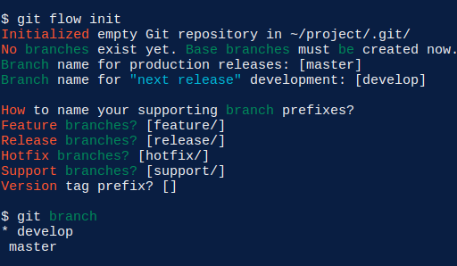
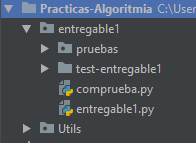
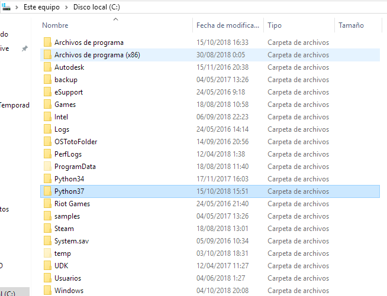
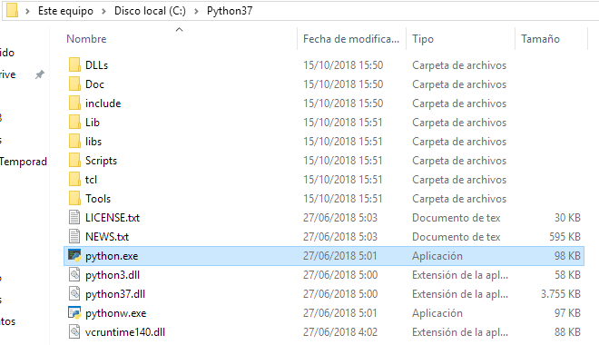
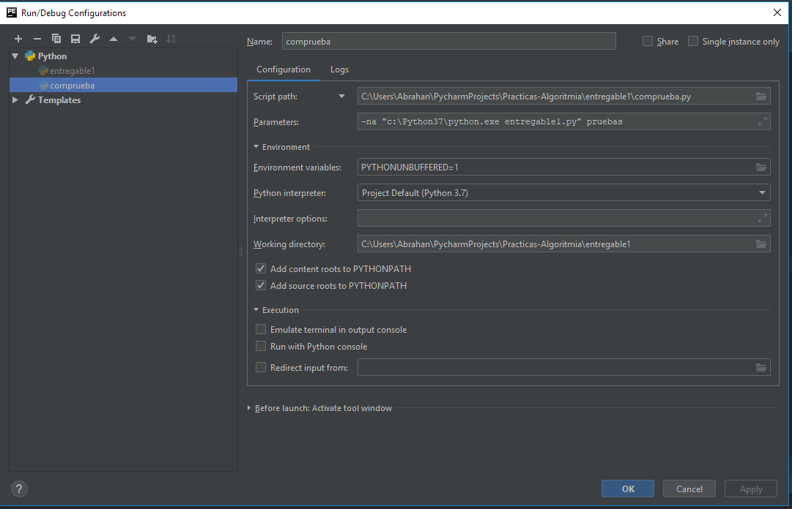

# Como crear nuevas ramas y uso de gitflow

En primer lugar siempre que se quiera editar un código sin perder la versión de la rama 'master' ha de crearse una rama desde master.

1. Comprobar si existe la rama `dev`:
    Antes de crear una nueva rama a partir de `master`, hay que comprobar si existe la rama `dev`. 
   
    `dev` es la rama donde se suben todos los `commit` que están en desarrollo (development).
   
    Para cambiar a esta rama debemos usar el comando de git:
    `git checkout dev`
    
    En ocasiones ejecutar esta instrucción nos dará un problema:
      1. Nuestra rama `master` local está desactualizada.
        En este caso ejecutamos `git pull` y ya estaría solucionado.
      2. La rama actual tiene cambios sin subir aun.
        En este caso commiteamos los cambios y los subimos con `push`.
        
     Bien, una vez en esta rama ya podemos realizar cambios sin 'desmoronar' el proyecto, pero cuidado, otros compañeros de equipo pueden estar subiendo su versión a dev y tu puedes 'machacar' su trabajo. Por ello se utilizan las `feature`.
     
2. Como usar las `features`:
  Para utilizar bien las `features` y el flujo de nuestro proyecto, existe un plugin de git llamado gitflow. Para usarlo, debemos seguir los siguientes pasos:
  1. Comprobar que no hay cambios en ninguna de nuestras ramas, para ello, cambiar una por una y hacer `git pull`
  2. Ubicarnos en la rama `master`.
  3. Iniciar gitflow en nuestro ordenador:
    `git flow init`
    Esto generará una secuencia de pasos para nombrar cada rama de gitflow como en la siguiente imagen, y te preguntara por el nombre de cada rama las unicas que deben tener el nombre establecido son master:`master` y development:`dev`. Seguir estos pasos de ejemplo:
    <pre>
        Branch name for production releases: [master] ↵
        Which branch should be used for integration of the "next release"?
           - dev
           - feature/abry
        Branch name for "next release" development: [] dev↵
        How to name your supporting branch prefixes?
        Feature branches? [feature/]↵
        Bugfix branches? [bugfix/]↵
        Release branches? [release/]↵
        Hotfix branches? [hotfix/]↵
        Support branches? [support/]↵
        Version tag prefix? []↵
        Hooks and filters directory? [/your/.../path]↵
    </pre>
    **Asegurarse introducir estos nombres cuando se pregunten por esas ramas.**
    
  4. Comenzar una nueva feature:
    `git flow feature start "nombre de la feature sin comillas (por ejemplo vuestro nombre) "`
  5. Trabajar nomral, haciendo `commits` y `push`
  6. Antes de finalizar una `feature` ya que esta se irá a `dev` hay que actualizar tu rama `dev` local:
     <pre>
          git checkot dev
          git pull
          git checkout feature/"nombre"
          git merge dev
          ***Resolver los conflictos si los hubiera, respetando 
          siempre todo lo que no hayas actualizado tu.***
          git flow feature finish feature/"nombre"
     </pre>

# Problemas a la hora de utilizar PyCharm

### 1. Ejecutar el test del primer entregable
  
Es posible que en windows tengamos problemas a la hora de poder ejecutar los tests delos entregables.
Para resolver esto, partiremos de la explicación de uso que nos ofrece el profesor en el primer entregable:
  
1. La jerarquía de ficheros de nuestro espacio de trabajo debe seguir la forma que se expresa en la siguiente imagen:

2. Siguiendo la guía, en windows deberemos ejecutar el siguiente comando: 

    <pre>
    c:\Python37\python3.exe comprueba.py -na "c:\Python37\python3.exe entregable1_solucion.py" pruebas
    </pre>

    Vamos a explicarlo en en detalle, en la primera parte:  
      <pre>
      c:\Python37\python3.exe comprueba.py
      </pre> 
      se ejecuta el programa `python3.exe` ubicado en la ruta`c:\Python37\` y con ese programa en funcionamiento se le pasa como parámetro el programa a ejecutar `comprueba.py`.
      En la segunda parte tenemos los argumentos del programa de python `comprueba.py`: 
      <pre>
      -na "c:\Python37\python3.exe entregable1_solucion.py" pruebas
      </pre>
      donde `-na` son flags del programa y `"c:\Python37\python3.exe entregable1_solucion.py"` es lo mismo que explicamos en el   apartado anterior, es decir que se ejecuta el programa de python `entregable1_solucion.py` dentro del otro programa de python `comprueba.py`.
      Y como os podréis imaginar, `pruebas` es el parámetro que se le pasa al segundo programa.
      
      Cabe destacar que esto no es absoluto, es decir, cada uno puede tener python3 en una ubicación diferente, normalmente, en windows, la carpeta de python se ubica en el directorio `C:`, en mi caso, se me instaló en el directorio `C:\Program Files`. Hay que tener cuidado con los nombres de los directorios con espacios en blanco, por ello copié esta carpeta al directorio superor `C:`.
      He de añadir que el supuesto archivo `python3.exe` en mi caso se llama `python.exe`. Hemos de tener cuidado y fijarnos en el PATH de este programa.
      
      
      
      
      Como habrán visto en la primera imagen, mi supuesto programa `entregable1_solucion.py` se llama `entregable1.py`, por lo que el comando que habremos de ejecutar (en mi caso) sería el siguiente:
      
    <pre>
    c:\Python37\python.exe comprueba.py -na "c:\Python37\python.exe entregable1.py" pruebas
    </pre>
      
  Si lo queremos ejecutar edentro del entorno de PyCharm, debemos seguir la siguiente configuración:
  1. Hacemos click derecho en la flecha verde que aparece en la primera línea del código, y a continuación en el tercer campo, `add parameters`.
  2. Dentro de la configuración de ejecución que se ha abierto, en el campo `parameters` añadimos los parámetros del programaa ejecutar (como se ve en la siguiente imagen) que en mi caso es: 
  <pre>
    na "c:\Python37\python.exe entregable1.py" pruebas
  </pre>
  
  3. Le damos a aplicar, y OK
  4. a partir de ahora los parámetros que se pasarán al programa al ejecutarse serán los indicados.
